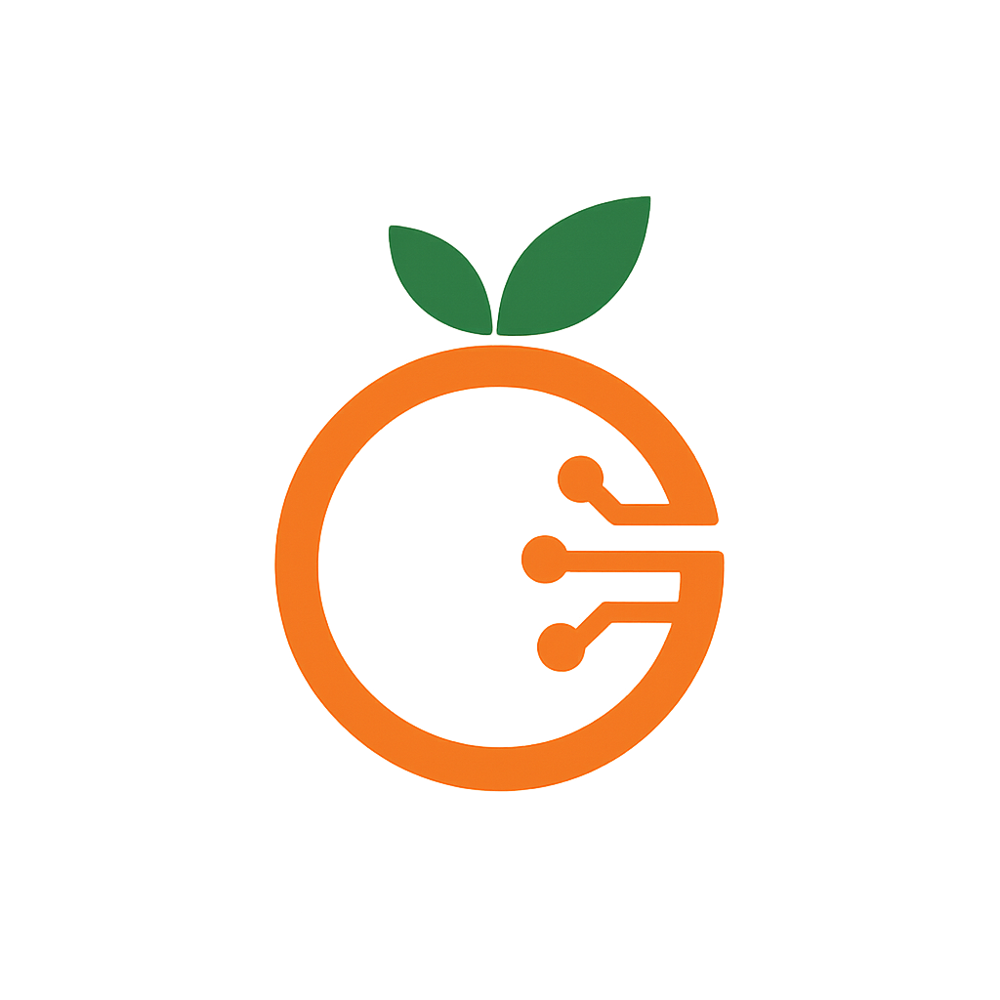
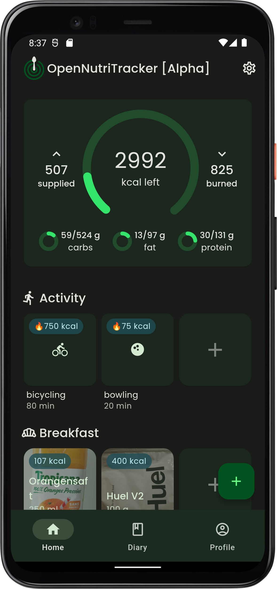
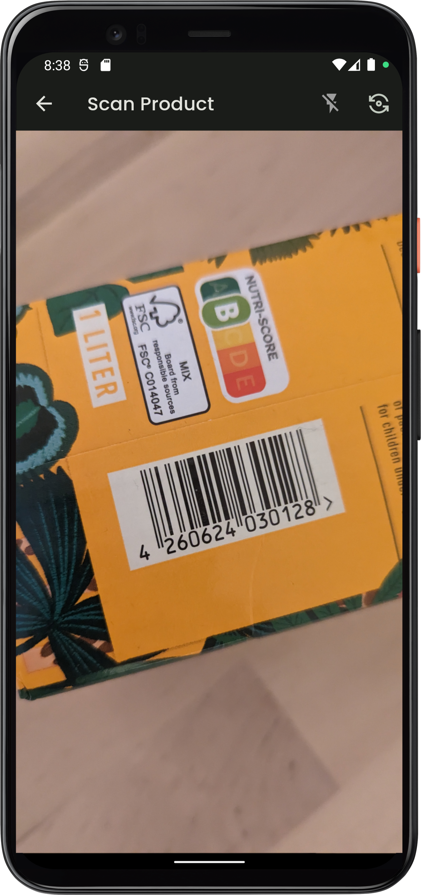
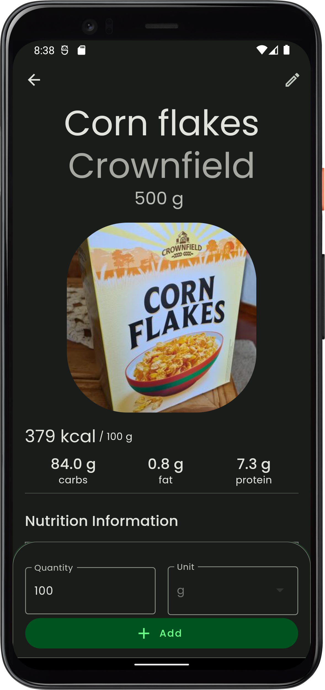
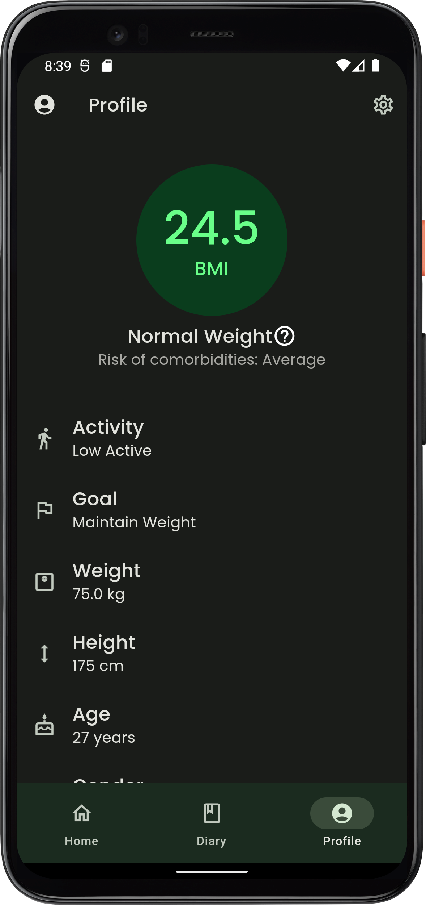

  
  <h1 align="center">CalorieAI</h1>
  <h3 align="center">The Next-Generation Nutrition Tracker</h3>

  
  
  
  

---

## Description

**CalorieAI** is the enhanced, next-generation version of **OpenNutriTracker**. Building on the original’s foundation of privacy, simplicity, and open-source values, CalorieAI introduces new intelligent features powered by AI to make nutrition tracking even easier, smarter, and more personalized.

Whether you’re focused on improving your health, losing weight, or maintaining a balanced diet, CalorieAI offers a sleek interface and advanced tools to help you track and analyze your daily nutrition with unprecedented ease.

[Website](https://axiona.at)

---

## Screenshots

  
  &nbsp;&nbsp;
  
  &nbsp;&nbsp;
  
  &nbsp;&nbsp;
  

<!-- ---

## Install

 -->

---

**Key Features :**
- **🍎 All the Features You Loved in OpenNutriTracker:**

  - **Gemini Photo \& Description:** Take a photo of your meal, and let CalorieAI’s AI-powered Gemini feature instantly recognize and describe your food, making logging faster and more accurate than ever.
  - Nutritional Tracking: Log meals and snacks with ease, using a vast database of food items and ingredients for detailed nutritional information.
  - Food Diary: Maintain a comprehensive food diary to track daily consumption and habits.
  - Custom Meals: Plan meals in advance and create personalized meal plans.- Barcode Scanner: Scan barcodes on packaged foods for instant nutritional info.
  - Privacy Focused: Your data stays on your device and is never shared without your consent.

## Privacy

See [Data Protection](https://www.iubenda.com/privacy-policy/53501884)

- **Data Encryption:** All user data is encrypted and stored locally on your device.
- **Minimal Data Collection:** Only the information necessary for tracking nutrition is collected—never shared with third parties without your consent.
- **Open-Source:** CalorieAI is open-source, so you can always review and contribute to the code.

---

## TODOs

- **Expand AI-powered meal recognition and description features**
- **Add more personalized nutrition insights and recommendations**

---

## Contribution

Contributions to CalorieAI are welcome! If you find any issues or have suggestions for new features, please open an issue or submit a pull request. Make sure to follow the project’s code style and guidelines.

---

## Disclaimer

CalorieAI is not a medical application. All data provided is for informational purposes only and should be used with caution. Please maintain a healthy lifestyle and consult a professional if you have any concerns. Use during illness, pregnancy, or lactation is not recommended.

The application is still under construction. Errors, bugs, and crashes may occur.

---

## Acknowledgments

CalorieAI is the next-generation evolution of OpenNutriTracker, inspired by the need for a simple, effective, and intelligent nutrition tracking tool.
The food database used is powered by [Open Food Facts](https://world.openfoodfacts.org/) and [Food Data Central](https://fdc.nal.usda.gov/).

A special thanks to all contributors and users who helped shape the original OpenNutriTracker and continue to support CalorieAI.

---

## License

This project is licensed under the GNU General Public License v3.0. See the [LICENSE](LICENSE) file for more information.

---

## Contact

For questions, suggestions, or collaborations, feel free to contact the project maintainer:

**Marc Reutz**

- **GitHub:** [@oasisjpeg](https://github.com/oasisjpeg)
- **Email:** [kontakt@axiona.at](mailto:kontakt@axiona.at) 
